# Spark from zero: what happens in this lab

A guide for someone who has never used Spark. It explains the ideas first, then what actually happens when you run `draft.ipynb`.

## 1. Why Spark exists

pandas loads a whole table into one computer's memory and processes it with one CPU core. That stops working when the data is bigger than one machine's memory, or when one core is too slow.

Spark's answer: **split the data into chunks (partitions) and process the chunks in parallel on many cores, across many machines.** You still write table operations (filter, join, group by), and Spark works out how to run them in parallel.

Our OpenFlights data (67 thousand routes, 4.5 MB) would fit in pandas easily. The lab uses it to learn the mechanics, which are the same for 67 thousand rows or 67 billion.

## 2. The cast

Think of a restaurant kitchen preparing a big order:

| Spark | Kitchen analogy | In this lab |
|---|---|---|
| **Driver** | Head chef: reads the order, plans the steps, hands out work, collects the results | The notebook process on your machine |
| **Cluster manager** (master) | Kitchen manager: knows which cooks are free and assigns them to the head chef | `spark-master` container |
| **Worker** | A kitchen station with its own space and equipment | `spark-worker-1`, `spark-worker-2` containers (4 cores, 6 GB each) |
| **Executor** | A cook working at a station for this order | A JVM process started inside each worker for our session |
| **Task** | One small job: "chop these 1000 onions" | Processing one partition of data |

The most important point: **the driver is where your code runs and where every plan is made.** The master only hands out resources and does no data processing. Executors do the heavy lifting.

## 3. Our setup



What happens, in order:

1. `spark_session()` runs. PySpark starts a **Java process (JVM) on your machine**: that JVM is the driver. Python talks to it through a library called py4j. This is why your machine needs Java even though the cluster is in Docker.
2. The driver tells the master (`spark://127.0.0.1:7077`): "I need executors."
3. The master asks both workers to start an executor for this session.
4. Each executor **connects back to the driver** and waits for work.
5. From then on, every query you run is planned by the driver and executed by the executors.

So PySpark here is **not** a thin client sending requests to a Spark server. Your notebook joins the cluster as its brain. (A thin-client mode does exist, called Spark Connect; see section 9.)

## 4. Lazy evaluation: why some cells are instant and others take seconds

Spark operations come in two kinds:

- **Transformations** describe a new table: `filter`, `select`, `join`, `groupBy`, `spark.sql("SELECT …")`, `g.find(...)`. They return immediately. Spark only records the step in a plan; no data is read.
- **Actions** need an actual result: `count()`, `show()`, `toPandas()`, `collect()`, `first()`. Only now does Spark run the whole plan.

Example from the notebook:

```python
edges = spark.sql("SELECT ... FROM flights GROUP BY src_id, dst_id")   # instant: just a plan
g.edges.count()                                                        # runs everything: read files, join, group
```

Lazy evaluation lets Spark see the whole chain before running it and optimise it as a unit. Its query optimiser is called **Catalyst**. For example, it applies a filter on the starting airport *before* the motif joins, instead of joining everything first.

`.cache()` tells Spark to keep a result in executor memory after it's first computed, so later actions on it don't recompute it from the files. We cache the graph's vertices and edges, which are reused by every task.

## 5. Partitions and shuffles

When an executor reads `routes.dat`, the file is split into **partitions**, and each partition becomes one task. Many operations work on each partition independently (`filter`, computing the haversine distance), with no communication between executors.

Some operations need rows that live in different partitions to meet:
- `GROUP BY airline_id`: all routes of one airline must end up together;
- `JOIN ... ON src_id = id`: each route must meet its airport row.

For these, Spark does a **shuffle**: every executor sorts its rows by key and sends each group to the executor responsible for that key. Shuffles are the expensive part of most Spark jobs, because they mean disk and network traffic.

`spark.sql.shuffle.partitions = 16` sets how many pieces a shuffle produces. The default is 200, which for our small data would mean 200 tiny tasks that each spend more time being scheduled than working. 16 is 2 per core across our 8 cores.

## 6. Where data lives: shared storage and local disks

Spark deals with two kinds of data, and they live in different places.

**Input and output** live in **shared storage**: HDFS, S3 or similar. Every executor reads its share of the input from there and writes the final result back there.

**Intermediate data** (shuffle files, and data spilled from memory when a sort or join doesn't fit) goes to each executor's **own local disk** (`spark.local.dir`, `/tmp` by default). Other executors fetch the pieces they need from it over the network.

```
shared storage ──read input──▶ executors ──shuffle files──▶ local disks
(HDFS / S3)                        ▲                            │
                                   └──── fetched over network ──┘
executors ──write final result──▶ shared storage
```

**Isn't HDFS a local disk too?** Physically, yes: HDFS stores its blocks on the DataNodes' local disks (in lab 1 you could see the `blk_…` files in a Docker volume). But you never use those disk paths. A program asks the NameNode where a file's blocks are and reads them over HDFS's network protocol, so every machine sees **one shared file system** with the same paths (`hdfs://namenode:9000/data/routes.dat`). "Shared" means shared access, not one physical disk. When an executor happens to run on a machine that holds the block it needs, Spark schedules the task there and the read stays on that machine (data locality).

**Why intermediate data doesn't go to HDFS:**
- **Cost.** HDFS writes every block three times across the network and registers every file with the NameNode. A shuffle can create thousands of small files that live for seconds, which would be pure overhead.
- **Spark doesn't need it to be durable.** If an executor dies and its shuffle files are lost, Spark **recomputes** them from the *lineage*: the recorded chain of steps that produced them from the input. Spark gets fault tolerance by recomputing; HDFS gets it by replicating.

**The exception: checkpoints.** Iterative algorithms such as connected components run dozens of rounds, each built on the previous one, so recomputing from the start would be very expensive. Spark therefore saves an intermediate result to **shared storage** every few rounds and cuts the lineage there. That's why the checkpoint directory must be on HDFS or S3 in a real cluster.

**How our setup imitates this.** We have no HDFS, so:
- `data/` is mounted into every container **at the same path**. That makes a plain file path like `file:///home/…/data/openflights/routes.dat` valid on every node, standing in for shared storage. Checkpoints go there too.
- Each executor's `/tmp` inside its own container is its local disk for shuffle files.
- `spark.shuffle.readHostLocalDisk = false` exists because of this setup. Normally, when a reader executor is on the same machine as the writer, Spark skips the network and opens the shuffle file directly from disk. Both our executors report host `127.0.0.1` (they share the host's network), so Spark assumed they share a disk, but each `/tmp` belongs to a different container. Turning the shortcut off makes them always fetch over the network.

**Variations in production:**
- **Co-located or separate storage.** In a classic Hadoop cluster (like lab 1), the same machines run a DataNode and a Spark worker, so HDFS blocks and Spark's scratch data share each machine's disks. In the cloud, storage is usually separate (S3) and every input read goes over the network.
- **Shuffle services.** By default the executor that wrote a shuffle file also serves it, so the file is gone if that executor dies. On YARN or Kubernetes an **external shuffle service** on each machine keeps serving the files after the executor is removed. Very large installations run **remote shuffle services** (Apache Celeborn, Uniffle) on dedicated servers: still not HDFS, because shuffle data needs speed, not replication.

## 7. Python on the executors

Most of our code is SQL and DataFrame operations. Spark turns these into JVM code, so the executors never need Python for them.

Python is needed on the executors only when you run **your own Python function** on the data (a UDF, `udf(...)`, or RDD code like `rdd.map(lambda ...)`). Each executor then starts a Python process to run it. That Python must be the **same minor version** as the notebook's (3.13), because Spark sends your function across in a version-specific binary format (pickle). This is why our Docker image installs Python 3.13: the official image only has 3.10.

## 8. Every line of `spark_session()`, explained

| Line | Plain-language reason |
|---|---|
| `os.environ["PYSPARK_PYTHON"] = "/usr/local/bin/python3.13"` | Tells executors which Python to start for UDFs (section 7). It's a path *inside the containers* |
| `.master("spark://127.0.0.1:7077")` | Use our cluster. Without it, Spark would run everything inside the notebook process (`local` mode) |
| `spark.driver.host` / `bindAddress = 127.0.0.1` | The address executors use to call the driver back (step ④ in section 3). The containers share the host's network, so that's localhost |
| `spark.driver.memory = 4g` | Memory for the driver JVM. It has to be set before the JVM starts, so it goes in the builder |
| `spark.jars.packages = io.graphframes:…` | GraphFrames' algorithms are Java/Scala code. The driver downloads the jars (the `:: resolving dependencies` output) and gives them to the executors |
| `spark.sql.shuffle.partitions = 16` | Fewer, bigger shuffle tasks for small data (section 5) |
| `spark.shuffle.readHostLocalDisk = false` | A quirk of our setup: both executors say they're on host `127.0.0.1`, so Spark would think they share a disk and try to read each other's files directly. They're in different containers, so that fails; this makes them use the network instead (section 6) |
| `spark.ui.showConsoleProgress = false`, `setLogLevel("ERROR")` | Keeps progress bars and log messages out of notebook outputs |
| `setCheckpointDir(data/checkpoints)` | Connected components saves intermediate results to disk every few iterations (section 10). Executors write those files, so the folder must exist at the same path in every container |

The same "executors do the work" logic explains the infrastructure. When the notebook does `spark.read.csv("/home/.../data/openflights/routes.dat")`, it's the **executors** that open that path, not the notebook. That's why `data/` is mounted into every container at exactly the same path. A real cluster would use shared storage such as HDFS or S3 instead (section 6).

## 9. Classic mode vs Spark Connect

| | Classic (this lab) | Spark Connect (Spark 3.4+) |
|---|---|---|
| Where the driver runs | In your notebook process | On a server; the notebook is a thin client |
| Java on your machine | Required | Not required |
| How you connect | `.master("spark://…")` | `.remote("sc://host:15002")` |
| Network | Executors must reach your machine | Your machine only reaches the server |
| What you can use | Everything, including `sparkContext` and RDDs | DataFrames and SQL only |

We use classic mode because GraphFrames' connected components needs `sparkContext.setCheckpointDir`, which Spark Connect doesn't offer, and GraphFrames' Connect support is still new.

## 10. GraphFrames in one page

A **GraphFrame** is just two Spark tables:
- `vertices`: one row per airport, with an `id` column;
- `edges`: one row per connection, with `src` and `dst` columns pointing at vertex ids.

Because a graph is just two tables, every graph operation becomes ordinary Spark work:

- **Motifs** (`g.find("(a)-[e1]->(b); (b)-[e2]->(c)")`) are translated into joins of the edges table with itself. A route with 3 segments means 3 edge tables joined on matching airports. The filters (start in Germany, end in the UK) are pushed down by Catalyst, which is why even 506 thousand routes take about a second.
- **BFS** expands outwards from the start vertices one step at a time (each step is a join) and stops at the **first** depth where it reaches a target. That's why it found only the 73 direct routes: it never looks deeper once something is found.
- **PageRank** is iterative: each iteration, every airport passes a share of its rank to the airports it links to (a join plus a group-by), repeated `maxIter` times. `resetProbability` is the chance of "jumping" to a random airport instead of following a route. At 0.85 the ranking becomes nearly flat.
- **Connected components** repeatedly passes the smallest id found so far between neighbours until nothing changes; airports with the same final id form one component. The plan grows with every iteration, so GraphFrames saves intermediate results to the **checkpoint directory** and restarts from them.
- **Label propagation** works the same way, but each airport adopts the most common label among its neighbours, which finds communities inside one big component.

## 11. Watching it run

While a cell runs, the web UIs show what's happening:

- **http://localhost:4040**, the driver's UI for our session. **Jobs** lists one entry per action. **Stages** shows the steps between shuffles, with each stage's tasks, time, and shuffle read/write sizes. **SQL / DataFrame** shows Catalyst's plan for each query, including the joins a motif turned into.
- **http://localhost:8080**, the master's UI: the two workers, their cores and memory, and our application with its executors.

A good exercise is to run the 3-segment motif cell, then open its job in the 4040 UI and find the three joins.

## 12. Glossary

| Term | Meaning |
|---|---|
| Action | An operation that needs a result and triggers execution (`count`, `toPandas`) |
| Catalyst | Spark's query optimiser; turns DataFrame/SQL code into an efficient plan |
| Checkpoint | Saving an intermediate result to disk to shorten a long chain of steps |
| Driver | The process that runs your code, plans queries and coordinates executors |
| Executor | A JVM process on a worker that runs tasks and holds cached data |
| External shuffle service | A process on each machine that keeps serving shuffle files after the executor that wrote them is gone |
| HDFS | Hadoop's distributed file system: DataNodes' local disks presented as one shared file system over the network |
| Job | All the work triggered by one action |
| JVM | Java Virtual Machine; Spark itself is written in Scala and runs on it |
| Lineage | The recorded chain of steps that produced a dataset; Spark uses it to recompute lost data |
| Partition | A chunk of a table; the unit of parallelism |
| py4j | The bridge PySpark uses to call the driver JVM from Python |
| Shuffle | Redistributing rows between executors by key (for joins and group-bys) |
| Spill | Writing data from memory to local disk when an operation doesn't fit in memory |
| Stage | A group of tasks that run without a shuffle in between |
| Task | The work on one partition within one stage |
| Transformation | An operation that describes a new table without running anything (`filter`, `join`) |
| UDF | User-defined function: your own Python function applied to rows; needs Python on executors |
| Worker | A machine (here, a container) that offers cores and memory to run executors |
